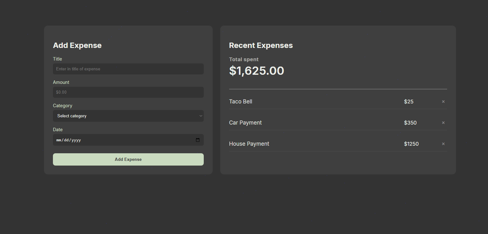

# Expense Tracker
---
## Tech Stack

**Frontend**
  - React (Vite)
  - HTML / CSS
  - Fetch API

**Backend**
  - Java 17
  - Spring Boot
  - Spring Data JPA
  - Hibernate
  - RESTful APIs

**Database**
  - PostgreSQL

**DevOps / Tooling**
  - Docker
  - Docker Compose
  - Maven
  - Git & GitHub

  ## Features
    - Adding expenses with title, amount spent, category and date. 
    - Stores data using PostgreSQL
    - REST API to create, delete, and fetch expenses
    - Dockerized setup for local developing

  
  


  ## Running Locally
    Prequisites 
      - Docker
      - Docker Compose
  ### Starting the app
    ```bash
    docker compose up --build

    
  --- 
  ```md
  ## Next Improvements (Future work).
    - User Auth
    - Filtering
    - Deployment

  ## Author
  **Zecarias Demissie**
  Github: https://github.com/zelcooo
